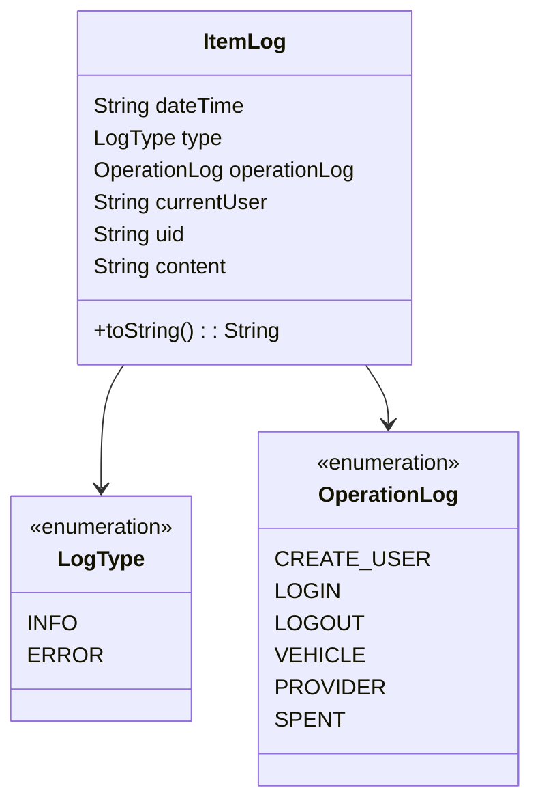

# Gestión de datos del Log

El log generado con las operaciones realizadas en nuestra aplicación, tanto web como Android, siguen este modelo de datos:



De este modo, tendremos para cada operación realizada sobre las colecciones Vehicle, Provider, Spent y además las operaciones de Login, Logout y Create_User.

La salida tendría esta estructura:

```json
[
	{
		content: "Edition of vehicle successfully"
		currentUser: "juanma@gmail.com"
		dateTime: "2024-06-01T20:34:17.410Z"
		operationLog: "VEHICLE"
		type: "INFO"
		uid: "KrmRWiE1pMMDsBoSFWJvZ8y4ouN2"
	},
	{
		content: "Login successfully"
		currentUser: "juanma@gmail.com"
		dateTime: "2024-06-02T14:00:07.509Z"
		operationLog: "LOGIN"
		type: "INFO"
		uid: "KrmRWiE1pMMDsBoSFWJvZ8y4ouN2"
	}, ...
]
```

Estos datos pueden ser extraídos a formato CSV para ser procesados posteriormente mediante Power Bi para generar el dashboard de gestión de la aplicación para los usuarios con rol de administrador.

Formato del archivo .CSV:


